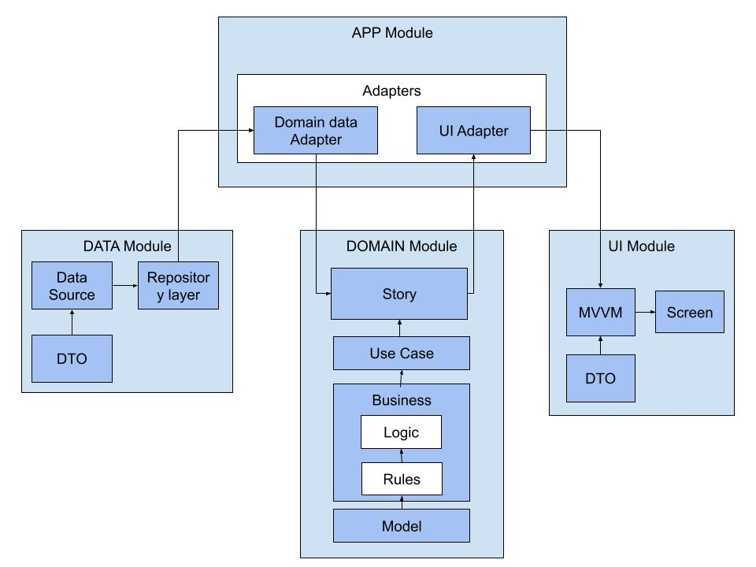

# Proposed Architecture for Interview Assessment

## Overview

The application has been restructured to utilize a modular architecture, where each module is a distinct library, either in Android or Kotlin. These modules are designed with specific responsibilities and incorporate various architectural patterns to ensure clean, maintainable code throughout.

## Modules
The following image describes with a diagram the architecture.


### APP
The App module is the cornerstone of the architecture, responsible for configuring and launching the application. It orchestrates the interconnection of other modules by implementing the adapter layers that each module exposes.

### UI
The UI module is responsible for constructing the application’s user interface. It employs the MVVM architecture to efficiently handle asynchronous data operations.

### DOMAIN
The Domain module is charged with overseeing all business logic and data-related rules within the application. It incorporates use cases and user stories to fully delineate each aspect of functionality.

### DATA
The Data module is responsible for handling all data sources and exposes the data through a repository pattern.

# Notes
* The injections files instantiate the classes, providing a practical context for their operation. In a real-world scenario, these could be replaced with a dependency injection library like Dagger or Koin for more streamlined management.
* To integrate the project with the Marvel API, create an env.json file in the [/data/src/main/assets](/data/src/main/assets) directory. The file should have the following structure:
```json
{
  "timestamp": 0,
  "publicKey": "",
  "privateKey": ""
}
```
* The [ComicRepositoryUnitTesting](/data/src/test/java/app/lhmako/data/retrofit/ComicRepositoryUnitTesting.kt) test sends a request to retrieve data from a Postman mock service. The test may fail if the request quota is exceeded
* To download the [Super Hero Card apk](https://drive.google.com/file/d/1Fgr1c6V6K8Uj_G79xRrxdT1PuvkI5Kp5/view?usp=sharing)
